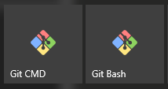
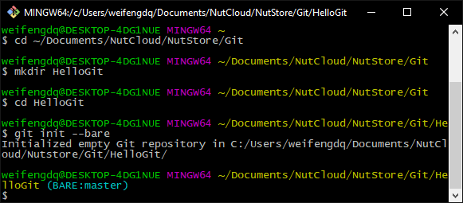
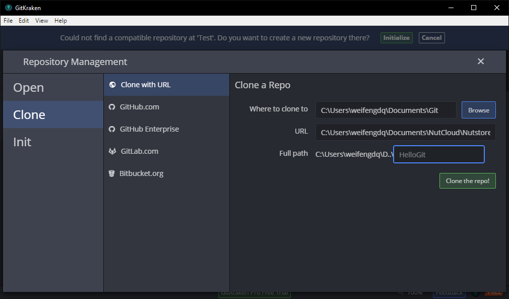
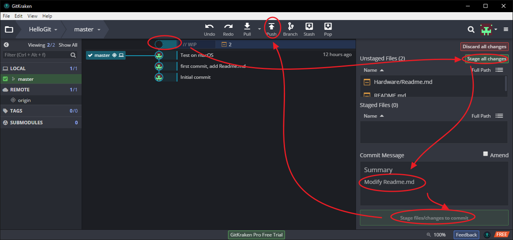

## 简介
尝试使用 Git, 坚果云, GitKraken, VS Code 等来建立跨平台可协作的私有Git仓库.  
[坚果云下载](https://www.jianguoyun.com/s/downloads)  
[Git下载](https://git-scm.com/)  
[GitKraken下载](https://www.gitkraken.com/)  
[VS Code下载](https://code.visualstudio.com/)  
首先阅读坚果云的一篇文章: [你的github-通过坚果云管理您的代码](http://help.jianguoyun.com/?p=3706)  
虽然一个 Git + VS Code足矣, 不过本着多点鼠标少命令行可以让更多人使用的特点, 我们就多点鼠标. 只使用VS Code的方法希望有人来写一下.  

## 以Windows平台为例  
打开Git CMD或者Git Bash(装了上面下载的Git都会有, 推荐Git Bash):  
  
常用的快捷键:  
- 复制 Ctrl + Insert  
- 粘贴 Shift + Insert
- 通用的 Tab补全, 上下切换命令. Ctrl+滚轮放大等.  

先建一个仓库(Repository):  
```
#拿我的坚果云做实验, 多人协作的话, 可放到公共的坚果云路径
cd ~/Documents/NutCloud/NutStore/Git
mkdir HelloGit
cd HelloGit
git init --bare
```
  


这样经坚果云同步多人就可以共同使用这个HelloGit仓库了. 打开GitKraken, File->Clone Repo->Clone with URL:  
Where to clone to, 点击Browse, 选择把仓库放到你本地的哪个文件夹.  
URL填入你的坚果云同步的HelloGit仓库的路径. 我的是 C:\Users\weifengdq\Documents\NutCloud\Nutstore\Git\HelloGit.  
  

然后就可以用VS Code编辑代码, 写文档了. Markdown文档的基本语法遍地都是, 找几个学几分钟就入门了, 直接用VS Code编辑即可. VS Code打开Clone到本地的HelloGit文件夹,  新建三个文件夹(Structure, Hardware, Embedded, 每个文件夹下新建一个文件Readme.md, 输入 #Hello, 文件名)和一个Readme.md, 在Readme.md中输入Hello, Git. Ctrl + S保存一下.   

打开GitKraken, 打开HelloGit仓库, 可以看到有变更文件, 点击文件可以查看相应变更, 点击Stage all changes, 在Commit Message中输入Description: first commit, add Readme.md. 点击下面的Commit changes. 再点击上方的push按钮, submmit即可.  
  
 


